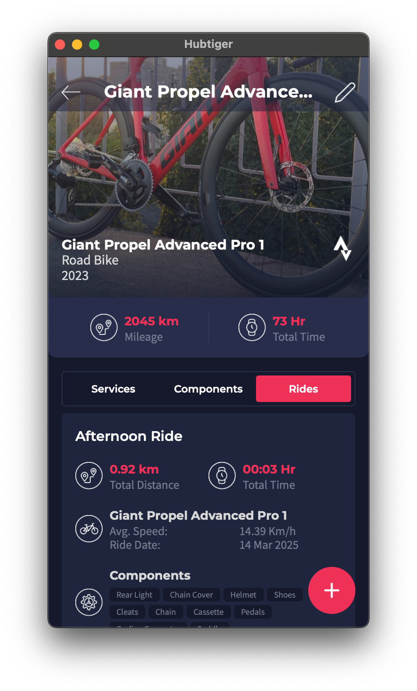

# Unofficial Hubtiger API

## How to do requests

1. Install [Visual Studio Code](https://code.visualstudio.com) with [Swagger Viewer](https://marketplace.visualstudio.com/items?itemName=Arjun.swagger-viewer) extension.
2. Open [`openapi.yaml`](./openapi.yaml) in Visual Studio code.
3. Press F1 and run the command `Preview Swagger`; or press `Shift + Alt + P` (on macOS `shift + option + P`).
4. Retrieve token with the `POST /Auth/ValidateLogin` by entering username and password.
5. Copy `token` value and paste it to the `Authorize` form.
6. Now you can perform any requests.

## Examples

Method          | Hubtiger App                                           | GET /Athlete/Bike/{bikeId}                     |
----------------| ------------------------------------------------------ | ---------------------------------------------- |
Bike rides      |  |  |
